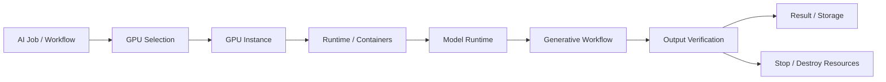

# AI GPU / Generative Media Infrastructure

## Overview
A reusable infrastructure pattern for running demanding generative-AI workloads without depending on a permanent high-cost GPU environment.

The system focuses on **provisioning, model execution, workflow repeatability, resource verification and cost control** across local and cloud GPU environments.

## High-level architecture

## Capabilities
- GPU offer comparison and resource selection
- environment provisioning
- model/runtime setup
- reusable ComfyUI / Python workflows
- image and video generation pipelines
- VRAM / RAM / storage-aware execution
- run verification
- stop / start / destroy lifecycle
- cost-conscious infrastructure decisions

## Selected stack
- Linux
- Docker / containerized runtimes
- Python
- ComfyUI
- cloud GPU providers
- open/local generative models
- JSON workflow definitions
- model/runtime automation

## Why it matters
Generative models often require expensive infrastructure. A reusable execution layer allows a team to choose GPU capacity per workload instead of permanently over-provisioning hardware.

## What it demonstrates
AI infrastructure · GPU operations · generative AI · deployment automation · cost optimization · workflow engineering

## My role
Infrastructure design, workflow architecture, model/runtime evaluation, GPU selection logic and operational testing.

## Public portfolio note
This case study intentionally omits detailed model recipes, tuned parameters, internal workflows and infrastructure configuration. The goal is to demonstrate the architecture without publishing the production know-how behind it.
