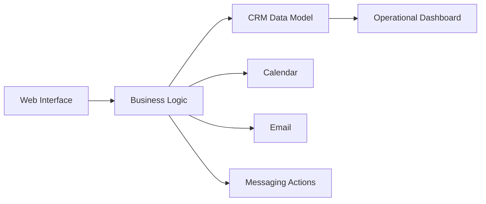

# Beauty Business Operations System

## Overview
A business operations platform built for a beauty professional to centralize the commercial and operational customer journey: lead → proposal → booking → follow-up → payment / service delivery.

The project demonstrates how relatively small businesses can adopt automation and AI without buying a large enterprise stack.

## Business problem
Customer data, appointments, messages and commercial follow-ups often live in different tools. That creates:

- duplicated manual work
- lost follow-ups
- fragmented customer history
- inconsistent sales processes
- limited operational visibility

## Solution
A lightweight operational application combining:

- CRM and prospect management
- client profiles
- quotations / commercial actions
- scheduling and calendar workflows
- follow-up logic
- email and messaging actions
- centralized customer history

## Architecture

## Selected stack
- JavaScript
- HTML / CSS
- web application UI
- Google Workspace APIs
- Gmail and Calendar integrations
- CRM data model
- backend automation services
- webhook / API integration patterns

## What it demonstrates
CRM architecture · customer operations · workflow automation · business process design · practical AI adoption

## My role
Business process mapping, CRM architecture, UX/workflow design, automation logic, integrations and implementation.

## Public portfolio note
Client identity, operational data and production source are not published.
