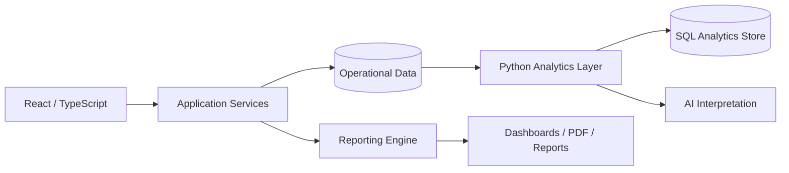

# Football Meta Pro — Analytics & Reporting SaaS

## Overview
A football analytics and reporting product designed to organize match/player information and transform it into structured analysis, visual dashboards and reusable reports.

The objective is to move from isolated observations to a repeatable analytical workflow that can support coaches, analysts, scouts or football operations.

## Product capabilities
- match and player analysis workflows
- structured football data
- dashboards and visual reporting
- reusable report generation
- PDF/export workflows
- domain-specific user experience
- foundation for AI-assisted interpretation

## Current implementation stack
### Frontend
- React
- TypeScript
- Vite
- Tailwind CSS

### Data / application services
- Firebase

### Analytics & reporting
- Recharts
- html2canvas
- jsPDF
- print / export workflows

## Scalable data architecture

The Python/SQL layer represents the natural expansion path for higher-volume analysis, feature engineering and model-assisted reporting.

## What it demonstrates
SaaS product design · data visualization · football domain workflows · reporting · analytics architecture

## My role
Product concept, workflow architecture, UX direction, analytics/reporting design and implementation.

## Public portfolio note
The production repository remains private. This document focuses on product architecture and technical decisions rather than proprietary code.
