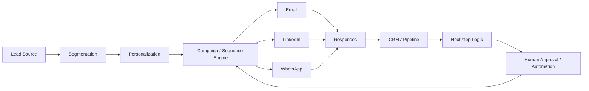

# Multichannel Lead Outreach & Sales Automation Platform

## Overview
A multichannel commercial automation platform designed to manage prospecting, campaign sequences, follow-ups and CRM updates across multiple channels while maintaining centralized commercial state.

The goal is not simply to send more messages. The platform coordinates **segmentation, personalization, sequencing, responses, next actions and CRM state** so outbound activity can scale without losing visibility or control.

## Workflow

## Capabilities
- lead segmentation
- personalized outreach
- multi-step campaigns and sequences
- multichannel execution
- response tracking
- follow-up scheduling
- CRM synchronization
- next-action logic
- manual / automated approval gates
- commercial history and status
- reporting on outreach activity

## Selected stack / integrations
- JavaScript
- CRM data models
- REST APIs
- webhooks
- email integrations
- LinkedIn outreach tooling
- WhatsApp workflows
- Google Workspace integrations
- campaign orchestration
- scheduled / event-driven automation

## Design principle
Automation should increase throughput **without removing visibility or control**. The CRM remains the system of record while channel tools execute individual interactions.

## What it demonstrates
Sales automation · RevOps · CRM architecture · campaign sequencing · APIs · webhooks · multichannel workflows

## My role
Commercial process mapping, CRM/workflow architecture, campaign and sequence design, integration logic and automation strategy.

## Public portfolio note
Lead lists, client data, production credentials and exact campaign logic are excluded.
