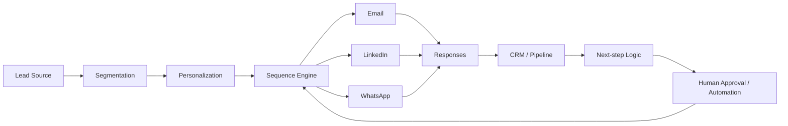

# Multichannel Lead Outreach & Sales Automation

## Overview
A multichannel commercial system designed to manage prospecting, outreach sequences, follow-ups and CRM updates across multiple channels while maintaining centralized commercial state.

The system is designed for real sales operations: automation where useful, human approval where appropriate.

## Workflow

## Capabilities
- lead segmentation
- personalized message generation
- multistep sequences
- multichannel outreach
- response tracking
- follow-up scheduling
- CRM synchronization
- next-action logic
- manual / automated approval gates
- reporting on outreach activity

## Selected stack / integrations
- JavaScript
- CRM data models
- REST APIs
- webhooks
- email integrations
- LinkedIn outreach tooling
- WhatsApp workflows
- Google Workspace integrations
- Campaign orchestration
- scheduled / event-driven automation

## Design principle
Automation should increase throughput **without removing visibility or control**. The CRM remains the system of record while channel tools execute individual interactions.

## What it demonstrates
Sales automation · RevOps · CRM architecture · APIs · sequence logic · multichannel workflows

## My role
Commercial process mapping, CRM/workflow architecture, channel sequence design, integration logic and automation strategy.

## Public portfolio note
Lead lists, client data, production credentials and exact campaign logic are excluded.
