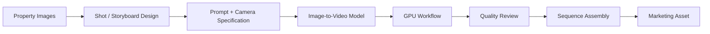

# AI-Assisted Luxury Real Estate Content Production

## Overview
A repeatable generative-AI production system for turning existing luxury-property images into cinematic marketing sequences and short-form video assets.

The challenge is not simply generating a clip. The system is designed around **shot planning, visual continuity, model selection, GPU execution and repeatable production workflows**.

## Workflow

## Selected stack
- ComfyUI
- Python-based workflow tooling
- structured JSON workflows
- Wan image-to-video workflows
- MiniMax image/video workflows
- GPU cloud infrastructure
- model / VRAM selection
- image-to-image and image-to-video pipelines

## Production concepts
- cinematic shot planning
- camera continuity
- multi-angle sequences
- outpainting / spatial expansion
- reusable prompt structures
- quality-control loops
- cost-aware GPU deployment

## Business value
The workflow is designed to produce differentiated luxury-property content from existing assets while reducing dependence on repeated physical video production.

## What it demonstrates
Generative AI · production systems · GPU workflows · creative operations · process standardization

## My role
Creative/technical workflow design, model evaluation, storyboard architecture, GPU workflow design and production testing.

## Public portfolio note
Client assets and proprietary production templates are not published.
