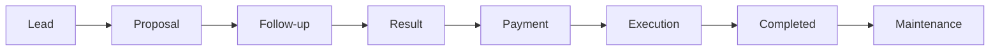

# Personal Business Operations / Master CRM System — Alejandro Laprea

## Overview
A master business-operations system designed to manage the complete commercial and delivery lifecycle from the first lead to ongoing maintenance.

Instead of treating CRM, projects and execution as separate tools, the system uses a shared data model and operational workflow.

## Core data model
- Clients
- Projects
- Commercial history
- Action queue
- Audit history
- Operational status / next steps

## Business lifecycle

## Capabilities
- structured client and project IDs
- centralized commercial history
- follow-up and action queue
- payment / execution state
- project delivery tracking
- audit trail
- reusable workflow across different service lines
- AI-assisted operational actions

## Architecture
The system is designed as a **master data + workflow layer**, allowing interfaces, automations and AI agents to operate on the same source of truth.

## What it demonstrates
Business operations architecture · CRM design · lifecycle automation · auditability · AI-ready structured data

## My role
Business process design, data architecture, workflow design, automation logic and operational implementation.

## Public portfolio note
Production data, customer records and internal automation rules are excluded.
