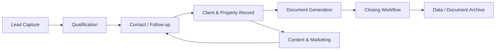

# Real Estate Business Operations / Master CRM System — Skyward

## Overview
A real-estate business operations architecture designed to centralize the lifecycle from lead capture through transaction closure and long-term client/property records.

The goal is to reduce fragmented work across messaging, documents, spreadsheets and marketing tools by organizing the process around a single operational model.

## Core workflow

## Capabilities
- lead capture and qualification
- contact history and follow-up
- client and property records
- automatic document / contract generation
- closing-document workflow
- content and marketing support
- document organization and archive
- centralized transaction history
- structured data for future analytics and AI use

## Frontend / product layer
A React-based real-estate experience supports the client-facing side while the operations architecture is designed to connect CRM state, documents, content and follow-up workflows.

## AI / automation opportunities
- lead classification
- follow-up drafting
- contract/document generation assistance
- content generation
- property/client matching
- closing checklist automation
- searchable knowledge and records

## What it demonstrates
Real-estate operations · CRM architecture · document automation · workflow design · data governance · AI adoption

## My role
Business-process architecture, CRM/data design, workflow automation, product design and AI-integration strategy.

## Public portfolio note
Exact document templates, client data and proprietary commercial workflows are intentionally excluded.
