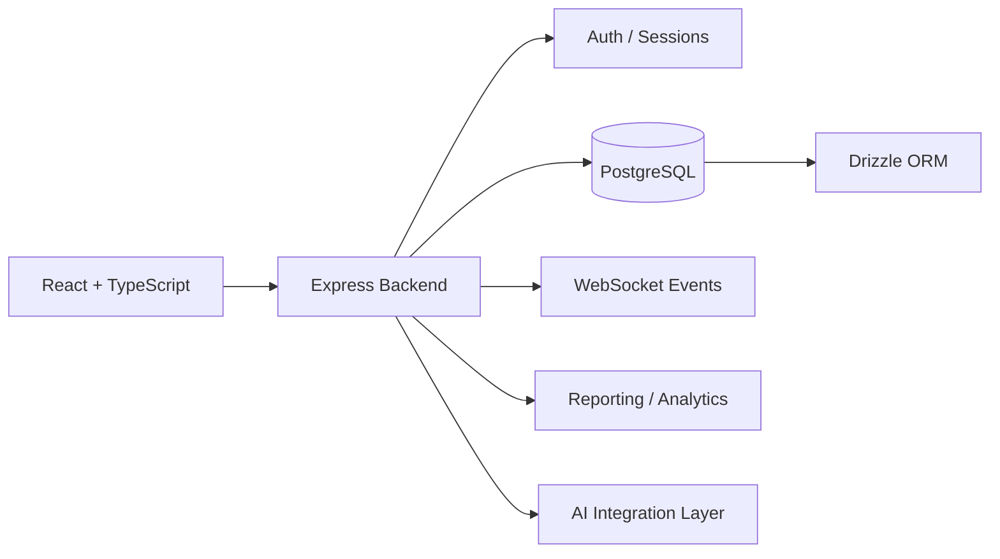

# Restaurant Reservation & Operations Platform

## Overview
A full-stack restaurant operations platform designed around reservations, customer information, internal workflows and operational visibility.

Unlike a simple booking bot, the architecture creates a structured application and data layer that can support automation, analytics and AI-assisted operations.

## Core capabilities
- reservations and customer records
- operational dashboard
- authentication and sessions
- structured database access
- live / event-driven updates
- reporting and analytics components
- API-ready service architecture

## Implemented architecture

## Implemented stack
### Frontend
- React
- TypeScript
- Vite
- Radix UI
- TanStack Query
- Tailwind ecosystem

### Backend
- Node.js
- Express
- REST-oriented services
- WebSockets
- Passport authentication
- Zod validation

### Data
- PostgreSQL
- SQL
- Drizzle ORM

### Analytics
- Recharts
- structured operational reporting

## AI / data extension
For heavier analytics or ML/AI workloads, the architecture can add **Python services** behind the API layer without coupling them to the frontend.

## What it demonstrates
Full-stack product architecture · database design · operations software · API design · scalable AI adoption

## My role
Product architecture, operational workflow design, data model direction, frontend/backend implementation and AI integration planning.

## Public portfolio note
This case study is based on a private implementation. Source code and client-specific configuration remain private.
