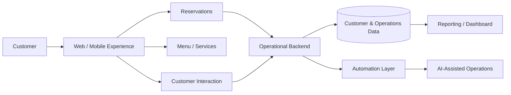

# Restaurant Reservation & Operations Platform

## Overview
A reusable restaurant-operations architecture demonstrated across **Arrechísimos, DOMODOMO and Valjunquera**.

The objective is broader than a booking widget: connect customer acquisition, reservations, service workflows, operational data and reporting into a structured system that can evolve toward automation and AI-assisted operations.

## Implementations

### Arrechísimos
The most complete full-stack implementation, with a structured frontend/backend and relational data layer.

**Implemented stack**
- React
- TypeScript
- Vite
- Node.js / Express
- PostgreSQL / SQL
- Drizzle ORM
- REST-oriented services
- WebSockets
- authentication / sessions
- Zod validation
- Recharts

### DOMODOMO
A lightweight operational web-app pattern connecting frontend experience with business logic and external integrations.

**Architecture pattern**
- web frontend
- operational backend/integration layer
- Netlify deployment
- API/workflow integrations
- centralized business actions

### Valjunquera
A customer-facing restaurant experience focused on discovery and conversion.

**Implemented areas**
- menu
- featured items
- gallery
- reservations
- reviews
- contact
- multilingual experience
- React / Vite frontend

## Shared architecture

## What it demonstrates
- reusable product architecture across different restaurants
- full-stack implementation
- SQL / relational data design
- customer experience
- reservations and service workflows
- analytics and reporting
- automation-ready operational systems

## My role
Product architecture, operational workflow design, data model direction, frontend/backend implementation, integration design and AI-adoption planning.

## Public portfolio note
The public case study combines patterns from multiple private/client implementations. Client-specific business logic and production data remain private.
