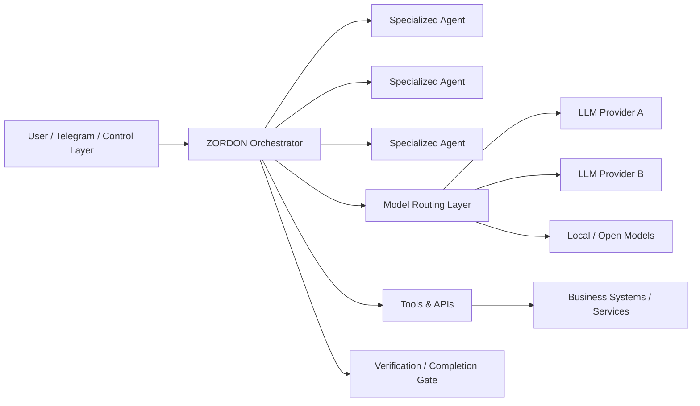

# ZORDON — Multi-Agent AI Orchestration Platform

## Overview
ZORDON is a self-hosted AI orchestration architecture designed to coordinate specialized agents, multiple LLM providers and operational tools through a central control layer.

The goal is not to build a single chatbot. It is to create an **execution system** capable of routing tasks, choosing appropriate models, using tools, validating outcomes and operating across recurring business workflows.

## Problem
Most AI assistants stop at generating an answer. Operational work requires more:

- task delegation across specialized capabilities
- model/provider selection
- tool execution
- retries and failure handling
- verification of actions and outputs
- controlled access to infrastructure
- cost-aware operation

## Architecture

## Selected stack
- Docker and Docker Compose
- Linux / VPS infrastructure
- GitHub Actions with controlled remote execution
- REST APIs and tool integrations
- Telegram as an operational interface
- multi-provider / multi-model routing
- self-hosted AI agent runtime
- verification and execution-control patterns

## Key capabilities
- multi-agent task delegation
- model routing and fallback
- operational tool use
- controlled remote execution
- completion verification
- reusable workflows
- cost-aware model selection

## My role
Architecture, orchestration design, infrastructure integration, workflow design, testing and operational implementation.

## Public portfolio note
Production configuration, provider credentials, prompts, security policies and infrastructure details are intentionally excluded from this public case study.
